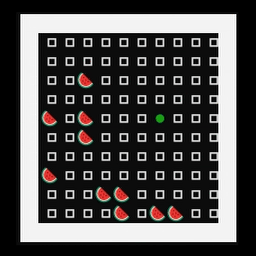

# TUI_snake_game

[](https://github.com/Arttu05/TUI_snake_game/actions/workflows/test_and_build.yml)

TUI(terminal user interface) snake game made with rust. Uses ratatui and crossterm to render game to terminal/console.  



## How to play

Play the game by running the binary. Binary **may** be available in the latest release, if not you can compile the binary youself with the instruction below. 

### Compiling the project

1. Clone the project with following command ```git clone https://github.com/Arttu05/TUI_snake_game.git```

2. Compile the project with following commnad: ```cargo build --realease```, while in project's root folder.

3. Now the binary for the program should be in ```target/release/``` with following name ```snake_game.exe```(windows) or ```snake_game```(linux). 

### Game Controls

Currently controls are hardcoded in ```consts.rs``` and are the following:

| Key | Action | Value in consts.rs |
|-----|-----------|-----------------|
| W   | Up        | `UP_KEY`        |
| A   | Left      | `RIGHT_KEY`     |
| S   | Down      | `DOWN_KEY`      |
| D   | Right     | `LEFT_KEY`      |
| ESC | Pause     | `PAUSE_KEY`     |

## Game settings

Game settings are stored in ```./settings.json```. If this file doens't exist the program will try to create it with default settings to the current working dir.

If values are incorrect in ```./settings.json```, the program will use default settings and give warning/notice that it wasn't able to use values in ```./settings.json```.

Datatypes of each setting:

| Variable Name            | Type                     | Description                                                                                     |
|--------------------------|--------------------------|-------------------------------------------------------------------------------------------------|
| fps                      | `u32`                    | How fast the game plays. Waits `1000 / fps` for inputs until rendering the next state.       |
| level_row_size           | `u32`                    | Defines how wide the level is.                                                                 |
| level_column_size        | `u32`                    | Defines how tall the level is.                                                                  |
| max_fruit_count         | `u32`                    | Defines how many fruits can be on the level at once.                                          |
| game_status              | `GameStatus (Enum)`     | Defines the game state: won, lost, active, or paused; should not be changed.                   |
| move_after_key_press     | `bool`                   | While true, after pressing a key, immediately handles the input. While false, waits the entire fps time and then handles the input. |
| snake                    | `Vec<ObjectCordinates>` | Contains the snake in a list. Each value in the list is a part of the snake. The first value must be `SnakeHead`. |

## TODO

- [x] Improve the error messages after error in engine init.
- [ ] Load controls from ```settings.json```
- [ ] Add more tests
- [x] Better win and lose screen
- [x] Prevent pause from closing immediately after pressing pause key.